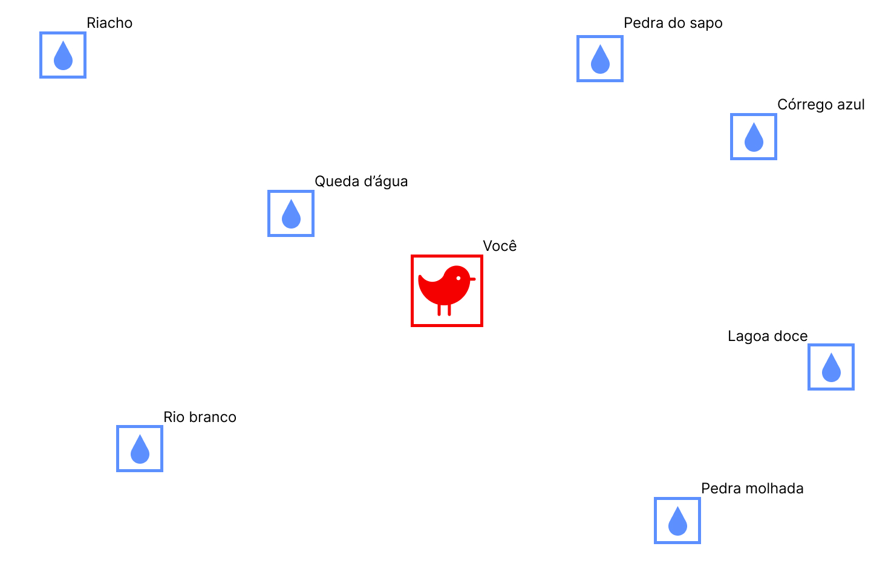
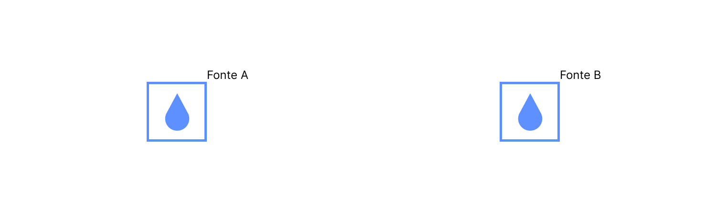
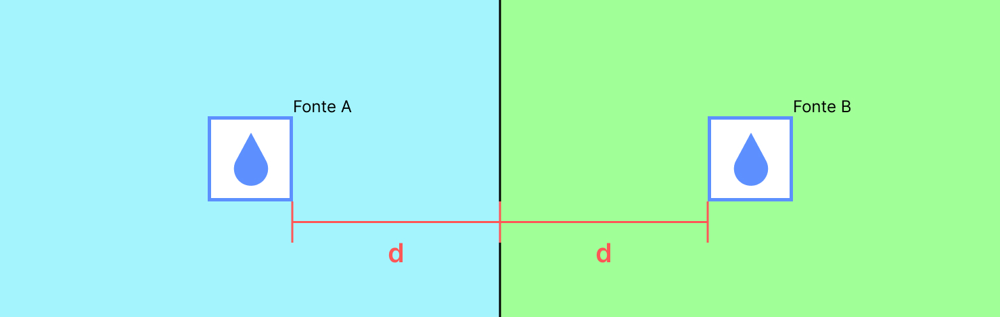
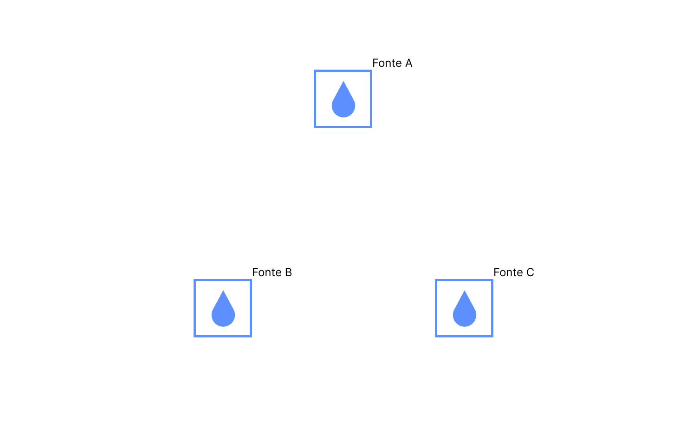
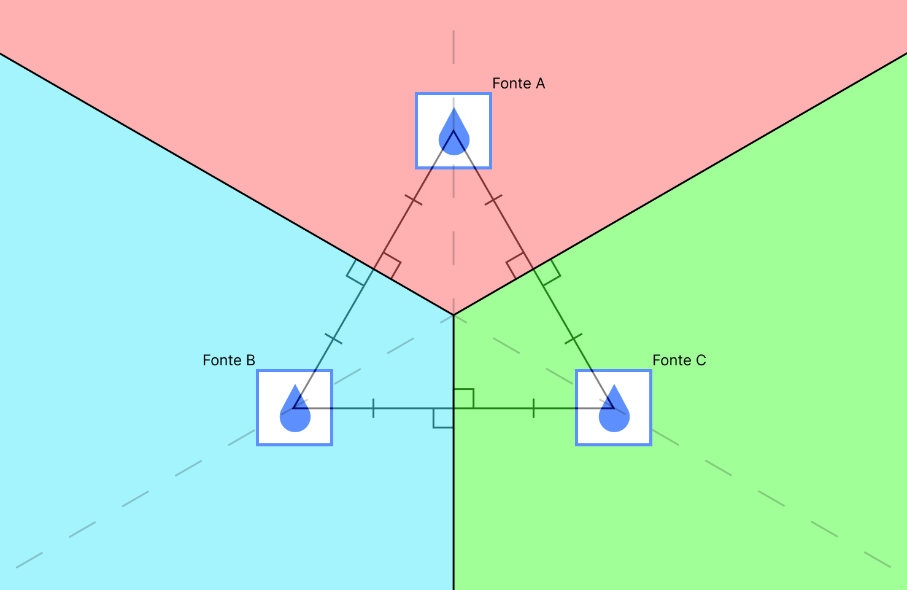

    
Algoritmo de Fortune para Diagrama de Voronoi

Image source: [virilo, Stack Overflow.](https://stackoverflow.com/questions/53696900/render-voronoi-diagram-to-numpy-array)

---

## Motivação

Imagine que você é um pássaro!
Você está voando o dia todo e não conseguiu beber nenhum gole de água. Por sorte, você sabe que ao seu redor, num raio de poucos quilômetros, existem algumas fontes de água. Aqui está o mapa da floresta:

Cada caixinha azul é um ponto de água diferente.

<question>

Como sabemos qual ponto de água mais próximo de você?

</question>

## Solução simples
Você sabe sua posição e a posição das fontes de água ao seu redor pois você é um pássaro e seu senso de localização é ótimo! (quase um GPS biológico).

É possível calcular todas as distâncias entre os você e cada um dos pontos utilizando o teorema de pitágoras.

**Tente encontrar o menor valor entre eles:**

Resposta

O arquivo `dist_m1.py` calcula todas essas distâncias e imprime seus valores.

|Lugar        | Distância |
| ----------- | --------- |
|Queda d'água | 1.12 km   |
|Riacho       | 2.92 km   |
|Pedra do sapo| 1.80 km   |
|Córrego azul | 2.24 km   |
|Rio Branco   | 2.24 km   |
|Pedra molhada| 2.12 km   |
|Lagoa doce   | 2.55 km   |

O ponto d'água mais próximo seria a **Queda d'água** com **1.12km** de distância

É notável que essa tarefa não é muito eficiente. E, se saíssemos da mesma posição, precisaríamos calcular todas as distâncias novamente.

E se existisse um mapa que indique, para qualquer posição, qual a fonte d'água mais próxima?

## Diagrama de Voronoi
Vamos começar por um exemplo simples. Temos apenas duas fontes d'água no nosso mapa:

Como podemos dividir esse espaço de modo a indicar, para qualquer ponto no mapa, qual a fonte mais próxima?

<question>

Pegue um papel e uma caneta e tente desenhar esse diagrama!

</question>

Resposta

Vamos traçar uma aresta que passa entre ambas as fontes e pintar de azul todos os pontos em que estão à esquerda dela e de verde aqueles que estão a sua direita:

Agora, sabemos que, se você estiver em qualquer ponto azul, o ponto mais próximo é a `Fonte A`. Se você estiver em qualquer ponto verde, porém, o ponto mais próximo é a `Fonte B`.

Agora vamos tentar com três pontos:

<question>

Pegue um papel e uma caneta e tente desenhar esse diagrama!

</question>

Resposta

Se traçarmos uma reta que divide cada um dos pontos d'água entre si, podemos criar três arestas que subdividem o espaço em três células distintas.

<!-- Se ligarmos uma reta ligando dois pontos quaisquer e traçarmos outra reta perpendicular a ela que cruza o seu centro, conseguimos subdividir o espaço com três arestas. -->

**Observe atentamente esse diagrama e preste atenção nos detalhes:**

- O cruzamento de todos os segmentos de reta é no **baricentro** do triangulo formado pelas ligações entre os pontos.

- O ângulo entre cada uma das arestas e as retas que ligam 2 pontos é de 90º.

- Uma aresta sempre **divide ao meio** uma reta que liga dois pontos.

Assim, é muito mais fácil ver qual o ponto d'água mais próximo para qualquer ponto do mapa!

